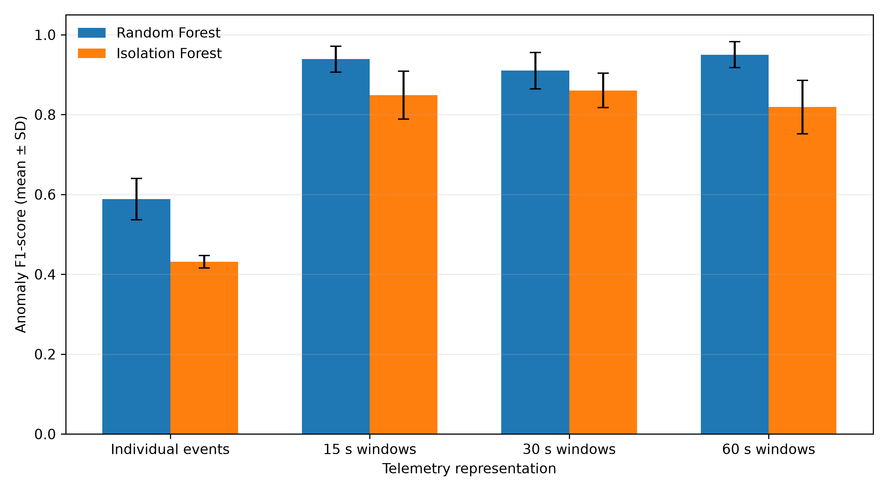

# Machine Learning Anomaly Detection in Cloud Telemetry

A reproducible research and deployment prototype for detecting contextual anomalies in synthetic service telemetry. The project compares isolated event observations with behavioural service-window aggregation, then exposes the validated Random Forest pipeline through an incremental inference API and interactive dashboard.

> This is an accelerated local research prototype built with synthetic telemetry. It is not a production cloud-monitoring platform and its results do not establish real-world generalisability.

## What the project demonstrates

- Six-service synthetic telemetry with overlapping normal behaviour and service-local incidents.
- Event-level and 15-, 30-, and 60-second behavioural-window representations.
- Random Forest and Isolation Forest under chronological 60/20/20 splits.
- Validation-only threshold selection and evaluation across five random seeds.
- Precision, recall, anomaly F1, false-positive rate, PR-AUC, incident recall, and detection delay.
- A near-real-time incremental inference path that consumes raw events and reuses the offline feature calculation.
- FastAPI, Streamlit, Docker, and automated regression tests.

## Key research result

Across the five evaluated seeds, behavioural aggregation improved mean anomaly F1 for both model families relative to individual-event inputs. Random Forest mean F1 increased from **0.588** at event level to **0.939**, **0.910**, and **0.950** for 15-, 30-, and 60-second windows. The best mean F1 therefore came with a longer approximate detection delay: **62.4 seconds** at 60 seconds versus **19.2 seconds** at 15 seconds. These values describe the implemented synthetic environment, not production infrastructure.



## Architecture

```text
Raw synthetic telemetry
        │
        ▼
Per-service fixed-window buffers
        │
        ▼
Shared behavioural feature extraction
        │
        ▼
Persisted preprocessing + Random Forest
        │
        ▼
Validation-selected anomaly threshold
        │
        ├── FastAPI response
        └── Streamlit dashboard
```

Ground-truth label, incident ID, and anomaly type are retained only for experimental evaluation. They are excluded from `MODEL_FEATURES` and from the API input schema.

## Quick start

Python 3.12 is recommended.

```bash
python -m venv .venv
.venv\Scripts\python -m pip install -r requirements.txt
.venv\Scripts\python -m pytest -q
```

The repository includes the audited 30-second Random Forest artifact used by the demo. To reproduce training from the generator instead:

```bash
.venv\Scripts\python -m training.train_window_model
```

### Dashboard

```bash
.venv\Scripts\streamlit run dashboard.py
```

Open `http://localhost:8501`, choose a seed and duration, and run the accelerated replay.

### API

```bash
.venv\Scripts\uvicorn app.api:app --reload
```

Open `http://localhost:8000/docs`. In another terminal, replay raw telemetry:

```bash
.venv\Scripts\python -m scripts.live_simulator --duration-seconds 300
```

The `POST /events` endpoint may return an empty list because a decision is emitted only when a behavioural window has closed. `POST /flush` is provided for finite demonstrations.

### Docker

```bash
docker compose up --build api
```

To start both services:

```bash
docker compose --profile dashboard up --build
```

## Repository map

```text
app/                 FastAPI ingestion and prediction interface
src/                 Generator, features, models, evaluation, and streaming core
training/            Reproducible training entry point
scripts/             HTTP replay and smoke-test utilities
tests/               Data, leakage, incremental-consistency, and API tests
models/              Persisted demonstration model artifact
results/             Audited five-seed summaries and dissertation figures
docs/                 Architecture, methodology, and limitations
dashboard.py          Interactive accelerated replay dashboard
Dockerfile            API container
docker-compose.yml    Local API/dashboard orchestration
```

## Evidence and limitations

The values in `results/` are copied from the final audited five-seed study rather than regenerated for presentation. See [methodology](docs/METHODOLOGY.md), [architecture](docs/ARCHITECTURE.md), and [limitations](docs/LIMITATIONS.md) for the experimental assumptions and boundaries.

## Background

This portfolio repository extends the implementation produced for the MSc Applied Artificial Intelligence dissertation, *Machine Learning-Based Anomaly Detection in Cloud System Logs*. The exploratory HDFS notebook and full dissertation material remain in a separate academic archive; this repository focuses on reproducible code and demonstrable inference.
